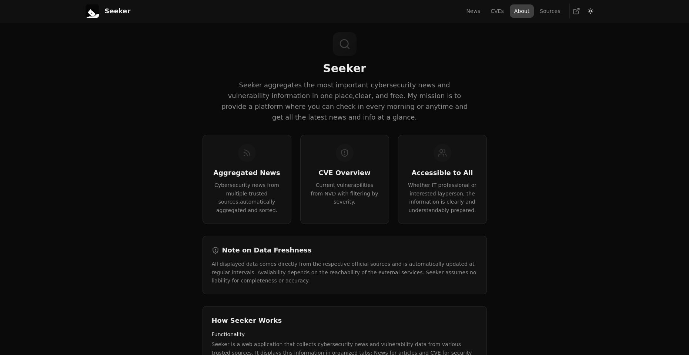

# Seeker


https://seekerr.netlify.app/

Seeker is a web application that aggregates and displays the latest cybersecurity news, CVE (Common Vulnerabilities and Exposures) details, and RSS feeds from various sources. It provides users with a centralized platform to stay informed about security updates and trends.

## Features

- **Cybersecurity News**: Stay updated with the latest news in the cybersecurity domain.
- **CVE Tracking**: View detailed information about recent vulnerabilities and exposures.
- **RSS Feed Integration**: Aggregate and display RSS feeds from multiple trusted sources.
- **Responsive Design**: Optimized for both mobile and desktop devices.
- **Dynamic Navigation**: Includes a dropdown menu for seamless navigation across all devices.
- **Customizable Themes**: Toggle between light and dark modes for better user experience.
- **Search Functionality**: Quickly find relevant news or CVE details.
- **Modular Components**: Built with reusable and maintainable React components.

## Installation

1. Clone the repository:
   ```bash
   git clone https://github.com/your-username/seeker.git
   ```

2. Navigate to the project directory:
   ```bash
   cd seeker
   ```

3. Install dependencies:
   ```bash
   npm install
   ```

## Usage

### Development Server

To start the development server, run:
```bash
npm run dev
```

### Build

To create a production build, run:
```bash
npm run build
```

### Preview

To preview the production build, run:
```bash
npm run preview
```

## Folder Structure

- `src/`: Contains the source code of the application.
  - `components/`: Reusable UI components.
  - `pages/`: Page-level components.
  - `services/`: API and data-fetching services.
  - `hooks/`: Custom React hooks.
- `public/`: Static assets.
- `netlify/`: Netlify-specific configurations.

## License

This project is licensed under the MIT License. See the LICENSE file for details.
